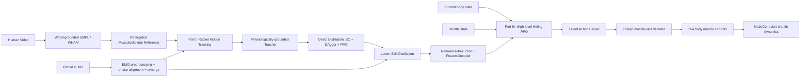

# 研究故事与论文叙事主线

> 面向项目：`yangfeiyang-123/asi_strengthen_musclemimic`
> 推荐主线：**动作跟踪 → 技能蒸馏 → 自适应击球**
> 生理主线：**显式肌电锚定 → 协同表征内化 → 无肌电部署继承**
> 方法关键词：**PEASD — Partial-EMG Anchored Synergy Distillation**
> 文档定位：用于论文叙事、开题/中期/答辩汇报、方法总览图和后续工程取舍。

---

## 0. 最推荐的一句话故事

> **我们首先从人体视频中恢复世界坐标下的运动参考，并训练肌肉驱动模型完成持拍动作跟踪；随后通过教师—学生蒸馏和低维技能学习，将依赖未来参考的跟踪策略转化为仅依赖当前状态的肌肉技能；最后冻结已学习的生理合理技能模型，仅训练高层策略根据来球状态在该技能空间内调整动作，从而完成自适应击球。少量 sEMG 不被用于恢复全部 354 个肌肉真值，而是作为部分生理锚点和训练期协同先验，逐步被内化到可无肌电部署的技能表示中。**

这句话已经包含了项目中最重要的四个层次：

1. 从视频获得人体运动；
2. 在物理仿真中学习肌肉驱动动作；
3. 将动作压缩为可复用的低维技能；
4. 在真实任务中根据球进行自适应调整。

---

## 1. 为什么必须分成三个部分

你的工作不能只讲成“用 PPO 让肌骨模型打羽毛球”，因为真正的困难来自三个不同问题。

### 1.1 动作跟踪问题：外部动作正确，不代表内部发力正确

人体视频、SMPL 和关节轨迹主要提供运动学约束：

$$
q_t^{sim}\approx q_t^{human}.
$$

但一个 354 肌肉执行器模型存在严重的冗余性。同一条关节轨迹可能由许多不同的肌肉募集方案实现：

$$
\{a_t^{(1)},a_t^{(2)},\ldots\}
\rightarrow
q_t^{human}.
$$

因此，只优化姿态误差，策略可能学到：

- 过度共收缩；
- 某些肌肉长期饱和；
- 发力顺序不符合真人；
- 使用不合理的代偿肌群；
- 视觉上相似，但生理解释错误。

这就是第一部分必须引入 sEMG 的原因。

### 1.2 技能蒸馏问题：跟踪策略依赖“未来答案”

动作跟踪 teacher 通常输入当前状态和未来参考：

$$
\pi_T(s_t,r_{t:t+H})\rightarrow a_t.
$$

它能准确模仿，是因为提前知道：

- 未来肩、肘、腕怎么运动；
- 动作处于哪个阶段；
- 击球动作最终要走向哪里。

但真正面对来球时，系统不能依赖一条预先给定的未来人体轨迹。需要把策略转化为：

$$
\pi_S(s_t,\phi_t)\rightarrow a_t,
$$

其中只保留当前可观测状态和必要的技能相位，不再读取未来 reference lookahead。

这就是第二部分“技能蒸馏”的核心。

### 1.3 击球问题：标准动作不是固定答案

即使系统已经会做标准正手高远球，面对不同来球仍需调整：

- 来球位置不同；
- 来球速度不同；
- 预计接触时间不同；
- 合理击球点不同；
- 拍头速度和拍面方向必须变化。

因此第三部分不是继续机械跟踪 reference，而是学习：

$$
\pi_{\mathrm{hit}}(s_t,b_t)\rightarrow \text{skill adjustment},
$$

其中 $b_t$ 表示羽毛球状态。

---

## 2. 三部分主线与代码内部阶段的对应关系

论文和汇报建议只讲三个部分；代码中的细分阶段作为实现细节放入方法或附录。

| 论文主线 | 代码中的组成 | 论文中应如何解释 |
|---|---|---|
| **Part I：动作跟踪** | Stage 1 body tracking；Stage 1R finger robustness；Stage 2 racket tracking | 从人体运动学习稳定、持拍、肌肉驱动的动作 teacher |
| **Part II：技能蒸馏** | teacher rollout；BC；DAgger；PPO refinement；posterior/prior/decoder latent distillation | 去掉未来 reference，并形成低维、可复用的肌肉技能 |
| **Part III：击球训练** | Stage 3 incoming-shuttle environment；LAB；high-level PPO；右手 grip/action routing | 根据当前人体和球状态调整低维技能并完成回球 |

这种合并方式有两个好处：

1. 避免论文被 Stage1、Stage1R、Stage2、BC、DAgger、latent、LAB 等工程名词切碎；
2. 每一部分都回答一个明确科学问题，而不是只报告训练顺序。

---

## 3. 整体方法图应该怎么画

图中 sEMG 不直接连到 Stage 3 policy。它的作用依次发生变化：

$$
\boxed{
\text{显式监督}
\rightarrow
\text{表征蒸馏}
\rightarrow
\text{隐式先验}
}
$$

---

## 4. 肌电先验如何贯穿三部分

### 4.1 Part I：显式生理锚定

在动作跟踪部分，sEMG 用于回答：

> 模型不仅是否“动得像人”，还是否“以类似的时序和协同方式发力”。

真实 sEMG 经预处理和相位对齐后得到：

$$
E(t)\in\mathbb R_+^M,
$$

其中 $M$ 是有效可比通道数。当前项目应使用 manifest 驱动的 $M$，不要把方法写死为 15 或 16：

- 若采集 16 通道但其中 1 个没有核验的模型同源肌肉，则 $M=15$；
- 若实际采集方案已经删除该通道，则直接以 15 通道运行；
- 数学和代码接口不变。

从真人信号中提取：

$$
E(t)\approx W_{\mathrm{EMG}}C_{\mathrm{EMG}}(t).
$$

仿真侧从 MuJoCo 实际 activation state 中取对应肌肉：

$$
y_t=P\,a_t^{sim},
$$

其中 $P$ 是名称安全的 $M\leftarrow354$ 观测算子。

然后只在可测子空间中约束：

- 各通道发力时序；
- 峰值相位；
- onset/offset；
- 协同组合；
- 协同系数时序。

不声称从少量通道恢复全部 354 路真实肌肉激活。

### 4.2 Part II：将协同内化到技能表示

动作 teacher 已经具有较好的生理合理性，但仅通过 action imitation，student 可能在压缩过程中丢失这种结构。

因此，在 latent distillation 中增加一个很小的训练期生理接口：

$$
q_\phi(z\mid s,r,h_{\mathrm{EMG}}),
\qquad
p_\psi(z\mid s),
\qquad
D_\theta(s,z)\rightarrow a.
$$

这里 $h_{\mathrm{EMG}}$ 是按动作相位查询到的低维协同上下文，而不是原始波形。

再加入一个轻量 synergy head：

$$
\hat h=G_\eta(z),
$$

并优化：

$$
L_{\mathrm{latent}}
=
L_{\mathrm{action}}
+\beta L_{\mathrm{KL}}
+\lambda_hL_{\mathrm{synergy}}
+\lambda_\Delta L_{\mathrm{temporal}}.
$$

这样：

- posterior 在训练时可以读取 EMG 协同；
- prior 仍只读取当前状态；
- KL 将 posterior 中的信息蒸馏给 prior；
- 部署时不需要 sEMG。

### 4.3 Part III：通过冻结技能模型继承生理先验

第三部分不再把当前动作强行匹配到某条标准 sEMG 曲线，因为不同来球本来就需要不同发力。

Stage 3 只在 learned skill manifold 附近做调整：

$$
z_t=
\mu_\psi(s_t)+
\lambda_{\mathrm{LAB}}
\sigma_\psi(s_t)
\tanh u_t.
$$

再由冻结 decoder 输出全身肌肉动作：

$$
a_t=D_\theta(s_t,z_t).
$$

所以第三部分对 EMG 的使用方式是：

> 不直接读取、不逐帧匹配，而是受到已经由 EMG 锚定的 prior/decoder 的结构约束。

---

## 5. 最推荐的 Simple and Effective 主方法

仓库的 PR 分支已经实现了 full-354、fixed synergy、synergy residual、Graph-NMF、continuity、latent decoder 等大量能力。论文主方法不宜把所有模块同时堆上去。

最推荐的主线是：

### 5.1 Part I 使用 PEASD-Lite

保持现有 full-354 tracking policy，不立即改变动作空间，仅增加两项小权重、带 curriculum 的生理 penalty：

$$
r_t=
r_t^{track}
-\lambda_A L_{\mathrm{anchor}}
-\lambda_S L_{\mathrm{synergy}}.
$$

优点：

- 不改变 PPO 网络和 action ABI；
- 不限制 354 维 teacher 的表达能力；
- 能直接验证少量 sEMG 是否提供有效约束；
- 与无 EMG teacher 形成公平对照；
- 失败时容易定位为数据、映射、时间对齐或 reward 问题。

### 5.2 Part II 使用轻量 privileged synergy distillation

保持现有 direct BC、DAgger、PPO 和 latent trainer 主干，只新增：

1. 数据集中的 `emg_synergy_mean/scale/valid`；
2. posterior 的可选 `emg_context`；
3. 一个很小的 `SynergyHead`；
4. 一个不确定性感知的 synergy loss；
5. EMG context dropout。

不建议第一版强制：

$$
z_{1:K}=C_{\mathrm{EMG}},
$$

因为 15 个表面通道无法解释全部 354 肌肉和全身动力学。使用可学习的小 head $G(z)$ 更稳健。

### 5.3 Part III 使用 frozen prior/decoder + LAB

不再增加新的 EMG loss。只训练高层 PPO 输出 raw latent adjustment。必要时允许非常小的右腕/前臂 bounded residual，但它必须：

- 只覆盖明确的 actuator 名称；
- 有独立幅值上限；
- 不成为第二个 full-354 policy；
- 与继承动作分开缩放。

---

## 6. 哪些复杂模块不应成为主故事

以下能力可以保留为消融、工程安全或后续工作，但不应同时写进主方法：

| 模块 | 推荐定位 |
|---|---|
| fixed-synergy action space | action-space ablation |
| fixed synergy + structured residual | 表达能力消融 |
| Graph-NMF | 协同提取方法消融 |
| fascicle continuity / IMR | 独立局部生理正则或附录 |
| ChinaJump primitive pipeline | 泛化任务或另一篇工作 |
| 24-run continuity matrix | 生理约束专项实验 |
| 大量 Stage 3 v6–v30 配置 | 工程探索记录，不进入主方法图 |

主论文只需一条清楚主线：

$$
\boxed{
\text{Full-354 physiological tracking teacher}
\rightarrow
\text{reference-free latent skill}
\rightarrow
\text{LAB-based adaptive hitting}
}
$$

---

## 7. 推荐的论文问题定义

### Research Question 1

> 少量表面肌电能否在不提供完整肌肉真值的情况下，提高视频驱动肌肉骨骼动作跟踪的生理合理性？

对应 Part I。

### Research Question 2

> 能否把依赖未来人体参考的高维肌肉控制策略，蒸馏为仅依赖当前状态、并保留人体协同结构的低维技能表示？

对应 Part II。

### Research Question 3

> 能否冻结该低层技能模型，只在低维技能空间中学习对来球的适应，从而降低高维击球探索难度并保持动作合理性？

对应 Part III。

三个问题连续递进，不是三个互相独立的小项目。

---

## 8. 可以写成论文贡献的内容

建议将贡献控制在四点以内。

### Contribution 1：视频到肌肉驱动持拍技能

建立从 world-grounded human motion 到持拍肌肉骨骼动作策略的完整链路，并通过分阶段 body/racket tracking 获得稳定 teacher。

### Contribution 2：部分肌电锚定

提出名称安全的 $M\leftarrow354$ activation observation operator，并在可测子空间内使用相位条件、带不确定性的 activation 与 synergy consistency，而不是进行不可辨识的 $M\rightarrow354$ 直接回归。

### Contribution 3：无肌电的协同技能蒸馏

将 EMG-derived synergy 作为训练期 privileged context，通过 posterior–prior KL 和 latent synergy head 蒸馏为仅依赖当前状态的低维肌肉技能，使推理不再需要未来参考或实时 EMG。

### Contribution 4：技能空间中的自适应击球

冻结低层 prior/decoder，使用 LAB 约束高层策略在 learned physiological skill manifold 附近根据来球进行调整，避免直接探索全部 354 个肌肉控制维度。

---

## 9. 不应写出的过度结论

必须避免以下表述：

- “15/16 路 EMG 恢复了 354 块肌肉的真实激活”；
- “NMF 得到的协同就是中枢神经系统真实模块”；
- “所有未测肌肉均被人体真值验证”；
- “EMG 与 MuJoCo activation 完全等价”；
- “当前 Stage 3 已经学会稳定过网回球”；
- “低维 latent 的每一维都具有明确解剖语义”；
- “固定 synergy 无条件优于 full-354 控制”。

更稳妥的词汇是：

- partial physiological anchor；
- EMG-derived coordination prior；
- measured-subspace consistency；
- physiologically grounded skill representation；
- global physiological plausibility proxy；
- reference-free deployment。

---

## 10. 建议的论文标题

### 最推荐

**PEASD: Partial-EMG Anchored Synergy Distillation for Reference-Free Musculoskeletal Badminton Skills**

中文：

**PEASD：面向无参考肌肉骨骼羽毛球技能的部分肌电锚定协同蒸馏**

### 更强调三阶段

**From Motion Tracking to Adaptive Hitting: Physiologically Grounded Latent Skill Learning for Musculoskeletal Badminton**

### 更强调视频输入

**Learning Adaptive Musculoskeletal Badminton Skills from Human Video with Partial-EMG Anchored Distillation**

---

## 11. 论文结构建议

### 1. Introduction

按下面顺序组织：

1. 视频可以恢复动作，但不能唯一确定内部肌肉控制；
2. 完整肌电覆盖不可行，少量关键肌肉更现实；
3. 动作跟踪策略依赖未来 reference，不能直接执行开放任务；
4. 直接在 354 维肌肉空间学习击球探索困难；
5. 因此提出三部分框架与 PEASD。

### 2. Related Work

只保留四类：

- video-to-human-motion / world-grounded pose；
- musculoskeletal motion imitation；
- muscle synergy / EMG-assisted control；
- policy distillation / latent action / athletic task RL。

### 3. Method

建议小节：

1. Overview；
2. Physiologically grounded racket motion tracking；
3. Partial-EMG activation and synergy anchoring；
4. Reference-free direct policy distillation；
5. Privileged latent synergy distillation；
6. LAB-based adaptive hitting。

### 4. Experiments

按研究问题组织，不按代码模块组织：

1. 动作跟踪与生理一致性；
2. 蒸馏是否去掉未来 reference；
3. latent 是否保留性能并降低维度；
4. Stage 3 是否提高接触、正出球、过网和泛化；
5. 消融与负对照。

---

## 12. 10 分钟汇报的讲法

### 第 1–2 分钟：问题

> 现有视频动作分析能告诉我们人体怎么动，却不能告诉我们内部肌肉如何协调；而让 354 个肌肉执行器直接从零学习打球又非常困难。

### 第 3–4 分钟：Part I

> 我们先从视频重建动作并重定向到肌骨模型，通过 PPO 学习持拍动作。少量 sEMG 不是 354 维真值，而是用于约束关键可测肌肉的时序和低维协同，使模型不仅动作相似，而且发力结构更接近真人。

### 第 5–6 分钟：Part II

> 跟踪策略依赖未来参考，因此我们用 teacher rollout、BC、DAgger 和 PPO 训练不看未来 reference 的 student；再通过 posterior、prior 和 decoder 把高维肌肉控制压缩到低维技能空间。训练时用 EMG 协同帮助 posterior 组织 latent，部署时 prior 只需要当前状态。

### 第 7–8 分钟：Part III

> 面对真实来球，高层 PPO 不再直接输出 354 个肌肉，而只在 learned skill manifold 内调整 latent，再由冻结 decoder 展开为全身肌肉控制。

### 第 9–10 分钟：贡献和实验

> 核心贡献不是用少量 EMG 猜出所有肌肉，而是用可验证的部分生理信息缩小高维控制解空间，并把这种信息蒸馏成无 EMG、无未来参考的可执行技能。

---

## 13. 可直接用于摘要的方法段

> We present a three-part framework for learning adaptive musculoskeletal badminton skills from human motion. First, a muscle-driven policy tracks retargeted racket motions, while partial surface EMG provides phase-conditioned physiological anchors over the subset of simulated muscle activations that can be reliably observed. Instead of treating sparse EMG as complete supervision for all actuators, we constrain measured activation timing and low-dimensional coordination structure. Second, we distill the future-reference tracking teacher into a reference-free skill model through behavior cloning, DAgger, and latent posterior–prior learning. EMG-derived synergy is used only as privileged training context and is transferred to a state-conditioned prior, allowing deployment without EMG. Finally, a high-level policy adapts the frozen skill through a latent action barrier according to the current body and shuttle state, avoiding direct exploration in the full muscle-control space.

---

## 14. 术语统一

| 容易混淆的说法 | 建议统一说法 |
|---|---|
| 动作跟踪 Stage 1 / Stage 2 | 论文中统一称 Part I，代码细分写在实现里 |
| 蒸馏 | direct policy distillation + latent skill distillation |
| 去掉 reference | 去掉 future reference lookahead；若仍使用 phase，应明确说明 |
| muscle action | normalized policy action |
| excitation | MuJoCo muscle control/effective excitation |
| activation | `data.act[actuator_actadr]` |
| EMG truth | EMG-derived activation proxy / physiological anchor |
| 16→354 | $M\leftarrow354$ observation projection，不是可逆恢复 |
| synergy | descriptive low-dimensional coordination structure |
| Stage 3 residual | task-level latent adjustment；小 residual 仅为受限补偿 |

---

## 15. 当前仓库状态应如何诚实写入论文计划

当前代码基础已经相当完整，但“代码存在”和“方法被实验证明”必须分开。

### 已有能力

- body/racket 分阶段 tracking；
- teacher–student BC、DAgger、PPO；
- posterior/prior/decoder latent 模块；
- LAB 和 Stage 3 action router；
- physical excitation/activation 采集；
- 354 通道 taxonomy、schema/hash/provenance；
- EMG 导入、映射和探索性评估；
- fixed synergy、residual synergy、Graph-NMF 和 continuity 等实验基础设施。

### 尚不能声称完成

- 经过正式证据审计的 impact-aligned EMG trial；
- 经过人工核验并允许训练的最终 EMG mapping；
- 正式 PEASD teacher 的多 seed 结果；
- privileged EMG latent distillation 的生产实现与结果；
- 稳定的正出球和过网 Stage 3 策略；
- 完整的主方法消融和统计结论。

论文故事可以现在确定，但论文结论必须等这些证据产生后再写。

---

## 16. 最终叙事模板

以后无论写论文、PPT、项目书还是答辩，都建议沿用下面的逻辑：

> **第一步，我们解决“如何正确执行人体动作”**：从视频恢复参考运动，在肌肉骨骼模型中学习持拍动作，并用少量 sEMG 锚定关键肌肉的发力时序和协同结构。
>
> **第二步，我们解决“如何摆脱未来动作答案”**：将 reference-conditioned teacher 蒸馏为 current-state-conditioned student，并把高维肌肉控制进一步组织成低维、无肌电部署的技能表示。
>
> **第三步，我们解决“如何根据真实来球调整”**：冻结低层肌肉技能，只训练高层策略在生理合理的 latent manifold 内进行有限调整，完成接触、过网和落点任务。
>
> 因此，本工作不是让强化学习从零搜索 354 个肌肉如何打球，而是先从人体运动与部分生理信号中学习一个可复用的肌肉技能，再在该技能空间中学习开放环境下的运动适应。

---

## 17. 依据与代码入口

本叙事依据以下材料整理：

- 用户提供的 `PEASD_16ch_EMG_synergy_plan.md`；
- 主分支 `fullbody/run_forehand_clear_pipeline.py`；
- `fullbody/run_distill_experiment.py`；
- `musclemimic/latent_muscle/networks.py`；
- `musclemimic/latent_muscle/train_latent.py`；
- `environment/overall_environment/src/stage3_lab.py`；
- PR #1 `agent/synergy-v3-forehand-clear` 分支；
- PR 文档 `docs/jidian_emg_integration.md`；
- PR 文档 `docs/肌肉生理约束实施契约_v2.md`；
- PR 文档 `doc/stage3_return_training_findings_20260805.md`。
